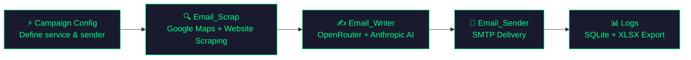

<p align="center">
  
</p>

<h1 align="center">Quinx AI</h1>

<p align="center">
  <strong>End-to-end cold email outreach automation — from lead scraping to inbox delivery.</strong>
</p>

<p align="center">
  
  
  
  
  
</p>

---

## 🎯 What is Quinx?

**Quinx AI** is a five-stage automation pipeline controlled entirely through a local GUI dashboard:

1. **⚡ Campaign** — Define the service you're pitching (name, tagline, context, pricing, sender) — saved as reusable JSON configs
2. **🔍 Scrape** — Find businesses on Google Maps, extract emails from their websites
3. **✍️ Write** — Generate hyper-personalized cold emails using AI (OpenRouter key rotation + Anthropic backup)
4. **🚀 Send** — Deliver emails via SMTP with human-like delays
5. **📊 Logs** — Track every campaign, lead, and download in a local SQLite database

All stages are orchestrated through the **Quinx GUI** — a FastAPI backend + React frontend running locally. Each stage runs as a background thread with live log streaming and a Stop button.

---

## 💰 What Quinx Replaces

<p align="center">
  
</p>

Quinx is a **self-hosted, open-source alternative** to an entire stack of expensive SaaS tools. Here's what you no longer need to pay for:

### Lead Scraping & Enrichment

| Tool | What It Does | Monthly Cost | Quinx Replacement |
|------|-------------|:------------:|-------------------|
|  | Lead database & prospecting | **$99/mo** | `Email_Scrap` — Google Maps scraping + email extraction |
|  | Email finder & verifier | **$49/mo** | `scrape_website_emails.py` — regex + BeautifulSoup extraction |
|  | B2B data enrichment | **$250/mo** | `enrich_lead.py` — website context scraping + Schema.org parsing |

### AI Email Writing

| Tool | What It Does | Monthly Cost | Quinx Replacement |
|------|-------------|:------------:|-------------------|
|  | AI copywriting assistant | **$49/mo** | `write_email.py` — multi-model AI with strict quality rules |
|  | AI marketing copy generator | **$49/mo** | Same — rule-bound AI with auto-retry & validation |

### Cold Email Sending & Campaigns

| Tool | What It Does | Monthly Cost | Quinx Replacement |
|------|-------------|:------------:|-------------------|
|  | Cold email at scale | **$30/mo** | `Email_Sender` — SMTP delivery with human-like delays |
|  | Personalized outreach | **$59/mo** | Full pipeline — scrape, personalize, send |
|  | Sales engagement platform | **$58/mo** | Quinx GUI — end-to-end orchestration |
|  | Cold email automation | **$49/mo** | SMTP delivery with send-folder verification |

### 💸 Total Savings

```
Monthly SaaS cost:   $693/mo  →  $8,316/year
Quinx cost:          $0/mo    (self-hosted, bring your own API keys)
─────────────────────────────────────────────────
You save:            ~$8,000+/year
```

> **Note:** Quinx only costs the API usage fees you'd pay anyway — Google Maps API (~$0.01/search), OpenRouter (~$0.001/email), and your own SMTP server.

---

## 🏗️ Architecture

```
Quinx/
├── Email_Scrap/             # Stage 2: Lead generation
│   ├── tools/
│   │   ├── pipeline.py          # Scraper entry point (called by GUI)
│   │   ├── google_maps_search.py
│   │   ├── scrape_website_emails.py
│   │   ├── build_leads_csv.py
│   │   └── ...
│   └── .env.example
├── Email_Writer/            # Stage 3: AI email generation
│   ├── tools/
│   │   ├── batch_write_emails.py  # Writer entry point (called by GUI)
│   │   ├── enrich_lead.py
│   │   ├── write_email.py
│   │   └── ...
│   └── .env.example
├── Email_Sender/            # Stage 4: Email delivery
│   ├── src/
│   │   ├── index.js             # Sender entry point (called by GUI)
│   │   ├── hostinger.js
│   │   ├── mailer.js
│   │   └── ...
│   └── .env.example
├── quinx-gui/               # 🖥️ GUI Control Panel (primary interface)
│   ├── backend/             # FastAPI + SQLAlchemy + SQLite
│   │   ├── main.py              # FastAPI app, CORS, router registration
│   │   ├── api/
│   │   │   ├── campaigns.py     # Campaign config CRUD + DB campaign routes
│   │   │   ├── scraper.py       # Launches Email_Scrap/tools/pipeline.py
│   │   │   ├── writer.py        # Launches Email_Writer/tools/batch_write_emails.py
│   │   │   ├── sender.py        # Launches Email_Sender/src/index.js
│   │   │   ├── users.py         # /me, email account settings
│   │   │   └── auth.py
│   │   ├── core/
│   │   │   ├── task_store.py    # In-memory threading task store (replaces Celery)
│   │   │   ├── models.py        # SQLAlchemy ORM models
│   │   │   ├── database.py      # SQLite engine + SessionLocal
│   │   │   └── security.py      # JWT auth + credential encryption
│   │   ├── campaign_configs/    # Reusable campaign JSON files
│   │   ├── exports/             # leads.xlsx + emails.xlsx per campaign
│   │   └── venv/
│   └── frontend/            # React 19 + Vite + Tailwind CSS v3
│       └── src/
│           ├── App.tsx
│           ├── lib/api.ts        # Fetch wrapper (GET, POST, DELETE, download)
│           ├── pages/
│           │   ├── Campaign.tsx  # Step 1: Service/campaign config manager
│           │   ├── Scraper.tsx   # Step 2: Lead scraping with live logs + Stop
│           │   ├── Writer.tsx    # Step 3: AI email generation with live logs + Stop
│           │   ├── Sender.tsx    # Step 4: SMTP dispatch with live logs + Stop
│           │   └── Logs.tsx      # Step 5: Campaign audit, delete, XLSX download
│           └── components/
│               └── Sidebar.tsx
└── docs/                    # Documentation assets
```

---

## 🔄 Pipeline Flow



### How It Works

| Stage | What Happens | Key Tech |
|-------|-------------|----------|
| **1. Campaign** | Define service name, tagline, context, pricing, sender name — saved as a reusable JSON config | React form, FastAPI file store |
| **2. Scrape** | Search Google Maps for businesses → scrape their websites for emails, phones, owner names → store in SQLite + XLSX | Google Places API, BeautifulSoup, Regex |
| **3. Write** | Load leads XLSX → enrich each lead with website context → generate personalized emails with strict quality rules → save emails XLSX | OpenRouter (key rotation, multi-model) + Anthropic backup |
| **4. Send** | Load emails XLSX → send via Hostinger SMTP with human-like random delays | Node.js, SMTP (Hostinger :465) |
| **5. Logs** | Browse all campaigns, download leads/emails XLSX, delete campaigns | SQLite, FastAPI, openpyxl |

Each stage runs as a **background thread** — the GUI polls for status every 2 seconds and streams live logs. Every stage has a **Stop** button that kills the subprocess.

---

## ⚡ Quick Start

### Prerequisites

- **Python 3.12+**
- **Node.js 18+** with npm
- API keys (see [Configuration](#️-configuration))

### 1. Clone the Repository

```bash
git clone https://github.com/YOUR_USERNAME/Quinx.git
cd Quinx
```

### 2. Set Up Tool Environment Files

```bash
# Email Scraper keys
cp Email_Scrap/.env.example Email_Scrap/.env

# Email Writer keys
cp Email_Writer/.env.example Email_Writer/.env
```

### 3. Install Dependencies

```bash
# Backend (Python)
cd quinx-gui/backend
python -m venv venv
venv\Scripts\activate        # Windows
# source venv/bin/activate   # macOS/Linux
pip install fastapi "uvicorn[standard]" sqlalchemy pydantic python-jose passlib bcrypt openpyxl python-dotenv pymupdf requests

# Frontend (React)
cd ../frontend
npm install

# Email Sender (Node.js)
cd ../../Email_Sender
npm install
```

### 4. Start the GUI

Open **two terminals**:

```bash
# Terminal 1 — Backend (FastAPI on :8001)
cd quinx-gui/backend
venv\Scripts\activate
uvicorn main:app --port 8001 --reload

# Terminal 2 — Frontend (React on :5173)
cd quinx-gui/frontend
npm run dev
```

Then open **http://localhost:5173** in your browser.

### 5. Workflow

1. **Campaign** → Create a campaign config (service name, tagline, context, pricing, sender name)
2. **Scraper** → Enter a niche + cities → click **EXECUTE_SCAN** → watch live logs
3. **Writer** → Select the campaign and config → click **EXECUTE_GENERATION** → live log streams
4. **Sender** → Add an SMTP account in Settings → select campaign → click **INITIATE_DISPATCH**
5. **Logs** → Download leads/emails XLSX, delete old campaigns

---

## 🖥️ GUI Modules

| Module | Route | Description |
|--------|-------|-------------|
| **⚡ Campaign** | `/campaign` | Create and manage campaign configs — service name, tagline, context, pricing, sender — stored as JSON in `campaign_configs/` |
| **🔍 Scraper** | `/scraper` | Set niche + cities + limit → run `Email_Scrap/tools/pipeline.py` → live log output → leads saved to SQLite + XLSX |
| **✍️ Writer** | `/writer` | Select campaign + config → run `Email_Writer/tools/batch_write_emails.py` → live log output → emails XLSX saved |
| **🚀 Sender** | `/sender` | Select campaign + SMTP account → run `Email_Sender/src/index.js` → live log output |
| **📊 Logs** | `/logs` | View all campaigns, lifecycle status, download leads/emails XLSX, delete per-row or clear all |
| **⚙️ Settings** | `/settings` | Add SMTP email accounts (encrypted in DB), view API spend |

> Every module streams real-time subprocess output and exposes a **Stop** button that kills the running process.

---

## ⚙️ Configuration

### Email_Scrap (`Email_Scrap/.env`)

| Variable | Description |
|----------|-------------|
| `GOOGLE_MAPS_API_KEY` | Google Maps Places API key |

### Email_Writer (`Email_Writer/.env`)

| Variable | Description |
|----------|-------------|
| `OPENROUTER_API_KEY_1` | OpenRouter API key (primary) |
| `OPENROUTER_API_KEY_2` | Fallback key — auto-rotated on rate limits |
| `OPENROUTER_API_KEY_3` | Fallback key — auto-rotated on rate limits |
| `OPENROUTER_API_KEY_4` | Fallback key — auto-rotated on rate limits |
| `ANTHROPIC_API_KEY` | Anthropic key (used when all OpenRouter keys exhausted) |

### Quinx GUI Backend (`quinx-gui/backend/.env`)

| Variable | Description | Default |
|----------|-------------|---------|
| `QUINX_BASE_DIR` | Absolute path to the Quinx repo root | `C:/Users/Sahil/Desktop/Quinx` |
| `SECRET_KEY` | JWT signing secret | change in production |

### SMTP Accounts

SMTP credentials (email, host, port, password) are added through the **Settings** page in the GUI. They are stored **encrypted** in the SQLite database — not in `.env` files. The sender backend decrypts them at runtime and passes them to the Node.js sender as environment variables.

---

## 📧 Email Quality Rules

The AI writer enforces strict rules to ensure high deliverability and engagement:

| Rule | Constraint |
|------|-----------|
| **Subject line** | < 9 words, no spam triggers |
| **Body length** | 90–130 words |
| **Personalization** | Must reference the business name |
| **Tone** | Conversational, no corporate speak |
| **Retry** | Auto-retries with correction prompt on rule violations |
| **Fallback** | Anthropic API used when all OpenRouter keys are exhausted |

---

## 🛡️ Safety Features

- **⏱️ Human-like delays** — Configurable min/max delay (seconds) between emails
- **🔄 Resume support** — Writer accepts `--start-from` to resume interrupted batches
- **🔑 API key rotation** — Auto-rotates OpenRouter keys on rate limits, falls back to Anthropic
- **✅ Email validation** — Strict AI output validation with auto-retry before saving
- **🔒 Encrypted credentials** — SMTP passwords encrypted in the database, never stored in plaintext
- **🛑 Stop button** — Every pipeline stage can be cancelled mid-run; subprocess is killed immediately

---

## 🗄️ Database

Quinx uses **SQLite** for zero-config data persistence, managed by the GUI backend:

| Table | Purpose |
|-------|---------|
| `campaigns` | Campaign name, niche, status, timestamps |
| `leads` | Scraped business contacts linked to campaigns |
| `email_accounts` | SMTP account credentials (encrypted) |
| `users` | Operator account, API spend tracking |

XLSX exports (leads + emails) are stored in `quinx-gui/backend/exports/` named `{campaign_id}_leads.xlsx` and `{campaign_id}_emails.xlsx`.

---

## 🧰 Tech Stack

| Layer | Technology |
|-------|-----------|
| **Lead Scraping** | Python, Google Maps Places API, BeautifulSoup, Regex |
| **Email Writing** | Python, OpenRouter (multi-model, key rotation), Anthropic backup, openpyxl |
| **Email Sending** | Node.js, Nodemailer, SMTP (Hostinger :465) |
| **GUI Backend** | FastAPI, SQLAlchemy, SQLite, threading (background tasks) |
| **GUI Frontend** | React 19, Vite, Tailwind CSS v3, React Router, TypeScript |
| **Task System** | In-memory task store with threading.Lock (no Redis/Celery required) |

---

## 📄 License

This project is private. All rights reserved.

---

<p align="center">
  Built with 💚 by <strong>Quinx AI</strong>
</p>
