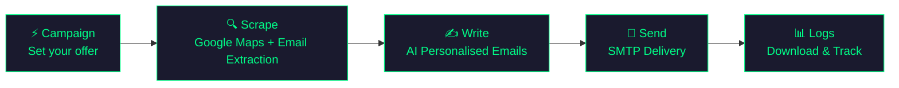

<p align="center">
  
</p>

<h1 align="center">Quinx</h1>

<p align="center">
  <strong>Find leads. Write emails. Close deals.</strong><br/>
  End-to-end cold outreach automation — from scraping to inbox delivery, all from one dashboard.
</p>

<p align="center">
  
  
  
  
  
</p>

<p align="center">
  
</p>

---

## What is Quinx?

Quinx is a five-step cold outreach pipeline controlled through a local GUI dashboard. You set it up once and it handles everything — finding leads, writing personalised emails, and sending them.

1. **Campaign** — Define your offer: product name, pitch, context, pricing, and your name
2. **Scrape** — Search Google Maps for businesses and extract verified emails from their websites
3. **Write** — AI reads each lead's website and writes a personalised cold email using your campaign details
4. **Send** — Deliver emails via your own SMTP with human-like delays to protect your domain
5. **Logs** — Track every campaign, download leads and emails as XLSX, delete old data

Every step runs in the background with live log output, a progress bar, and a Stop button. Switching pages mid-run doesn't interrupt anything — state is preserved across navigation.

---

## What Quinx Replaces

Quinx is a **self-hosted, open-source alternative** to an entire stack of expensive SaaS tools:

### Lead Scraping & Enrichment

| Tool | What It Does | Monthly Cost | Quinx Replacement |
|------|-------------|:------------:|-------------------|
| Apollo.io | Lead database & prospecting | **$99/mo** | `Email_Scrap` — Google Maps + email extraction |
| Hunter.io | Email finder & verifier | **$49/mo** | `scrape_website_emails.py` — regex + BeautifulSoup |
| ZoomInfo | B2B data enrichment | **$250/mo** | `enrich_lead.py` — website context + Schema.org |

### AI Email Writing

| Tool | What It Does | Monthly Cost | Quinx Replacement |
|------|-------------|:------------:|-------------------|
| Jasper AI | AI copywriting assistant | **$49/mo** | `write_email.py` — multi-model AI with quality rules |
| Copy.ai | AI marketing copy | **$49/mo** | Same — auto-retry & validation built in |

### Cold Email Sending

| Tool | What It Does | Monthly Cost | Quinx Replacement |
|------|-------------|:------------:|-------------------|
| Instantly.ai | Cold email at scale | **$30/mo** | `Email_Sender` — SMTP with human-like delays |
| Lemlist | Personalised outreach | **$59/mo** | Full pipeline — scrape, personalise, send |
| Mailshake | Sales engagement | **$58/mo** | Quinx GUI — end-to-end orchestration |
| Woodpecker | Cold email automation | **$49/mo** | SMTP delivery with send-folder verification |

### Total Savings

```
Monthly SaaS cost:   $693/mo  →  $8,316/year
Quinx cost:          $0/mo    (self-hosted, bring your own API keys)
─────────────────────────────────────────────
You save:            ~$8,000+/year
```

> Quinx only costs what you'd pay anyway — Google Maps API (~$0.01/search), OpenRouter (~$0.001/email), and your own SMTP server.

---

## Architecture

```
Quinx/
├── Email_Scrap/             # Step 2: Lead generation
│   ├── tools/
│   │   ├── pipeline.py              # Scraper entry point (called by GUI)
│   │   ├── google_maps_search.py
│   │   ├── scrape_website_emails.py  # --max-emails N stops once N emails found
│   │   ├── build_leads_csv.py
│   │   └── ...
│   └── .env.example
├── Email_Writer/            # Step 3: AI email generation
│   ├── tools/
│   │   ├── batch_write_emails.py    # Writer entry point (called by GUI)
│   │   ├── enrich_lead.py
│   │   ├── write_email.py
│   │   └── ...
│   └── .env.example
├── Email_Sender/            # Step 4: Email delivery
│   ├── src/
│   │   ├── index.js                 # Sender entry point (called by GUI)
│   │   └── ...
│   └── .env.example
├── quinx-gui/               # GUI Control Panel (primary interface)
│   ├── backend/             # FastAPI + SQLAlchemy + SQLite
│   │   ├── main.py
│   │   ├── api/
│   │   │   ├── campaigns.py
│   │   │   ├── scraper.py
│   │   │   ├── writer.py
│   │   │   ├── sender.py
│   │   │   ├── users.py
│   │   │   └── auth.py
│   │   ├── core/
│   │   │   ├── task_store.py        # Background threading (no Redis/Celery)
│   │   │   ├── models.py
│   │   │   ├── database.py
│   │   │   └── security.py         # JWT + credential encryption
│   │   ├── campaign_configs/        # Reusable campaign JSON files
│   │   └── exports/                 # leads.xlsx + emails.xlsx per campaign
│   └── frontend/            # React 19 + Vite + Tailwind CSS
│       └── src/
│           ├── App.tsx
│           ├── lib/
│           │   ├── api.ts            # Fetch wrapper
│           │   ├── scraperStore.tsx  # Global scraper state (persists across pages)
│           │   ├── writerStore.tsx   # Global writer state (persists across pages)
│           │   └── senderStore.tsx   # Global sender state (persists across pages)
│           ├── pages/
│           │   ├── LandingPage.tsx
│           │   ├── Campaign.tsx
│           │   ├── Scraper.tsx
│           │   ├── Writer.tsx
│           │   ├── Sender.tsx
│           │   └── Logs.tsx
│           └── components/
│               └── Sidebar.tsx
└── docs/
```

---

## Pipeline Flow



| Step | What Happens | Key Tech |
|------|-------------|----------|
| **1. Campaign** | Define service name, pitch, context, pricing, your name — saved as a reusable JSON | React form, FastAPI file store |
| **2. Scrape** | Search Google Maps → scrape websites for emails → store in SQLite + XLSX. Stops as soon as the target email count is hit (`--max-emails N`) | Google Places API, BeautifulSoup, Regex |
| **3. Write** | Load leads → AI reads each website → writes a personalised email per lead → saves emails XLSX | OpenRouter (key rotation, multi-model) + Anthropic backup |
| **4. Send** | Load emails → send via SMTP with human-like random delays between each | Hostinger SMTP :465 |
| **5. Logs** | Browse all campaigns, download leads/emails XLSX, delete campaigns | SQLite, FastAPI, openpyxl |

Each step runs as a **background thread** — the GUI polls every 2 seconds and streams live logs. Every step has a **Stop** button and a **progress bar**. Navigating away from a page mid-run does not stop the process — job state is kept alive in React Context providers.

---

## Quick Start

### Prerequisites

- **Python 3.12+**
- **Node.js 18+**
- API keys (see [Configuration](#configuration))

### 1. Clone

```bash
git clone https://github.com/Oxirane-git/Quinx.git
cd Quinx
```

### 2. Set Up Environment Files

```bash
cp Email_Scrap/.env.example Email_Scrap/.env
cp Email_Writer/.env.example Email_Writer/.env
```

### 3. Install Dependencies

```bash
# Backend (Python)
cd quinx-gui/backend
python -m venv venv
venv\Scripts\activate        # Windows
# source venv/bin/activate   # macOS/Linux
pip install fastapi "uvicorn[standard]" sqlalchemy pydantic python-jose passlib bcrypt openpyxl python-dotenv pymupdf requests

# Frontend (React)
cd ../frontend
npm install

# Email Sender (Node.js)
cd ../../Email_Sender
npm install
```

### 4. Start

Open **two terminals**:

```bash
# Terminal 1 — Backend (FastAPI on :8001)
cd quinx-gui/backend
venv\Scripts\activate
uvicorn main:app --port 8001 --reload

# Terminal 2 — Frontend (React on :5173)
cd quinx-gui/frontend
npm run dev
```

Open **http://localhost:5173** in your browser.

### 5. Workflow

1. **Campaign** → Create a campaign (your product name, pitch, context, pricing, your name)
2. **Scrape** → Enter a business type + cities → click **Start Scraping** → watch live logs
3. **Write** → Select the campaign → click **Start Writing** → AI writes personalised emails
4. **Send** → Add an SMTP account in Settings → select campaign → click **Send Emails**
5. **Logs** → Download leads/emails XLSX, delete old campaigns

---

## GUI Pages

| Page | Route | Description |
|------|-------|-------------|
| **Home** | `/` | Landing page — overview of what Quinx does |
| **Campaign** | `/campaign` | Create and manage campaigns — offer details saved as JSON |
| **Scrape** | `/scraper` | Set niche + cities + email target → scrape → download leads XLSX |
| **Write** | `/writer` | Select campaign → AI writes personalised emails → download emails XLSX |
| **Send** | `/sender` | Select campaign + SMTP account → send with delays → live log |
| **Logs** | `/logs` | All campaigns, lifecycle status, download buttons, delete |
| **Settings** | `/settings` | Add SMTP accounts (encrypted), view AI spend |

---

## Configuration

### Email_Scrap (`Email_Scrap/.env`)

| Variable | Description |
|----------|-------------|
| `GOOGLE_MAPS_API_KEY` | Google Maps Places API key |

### Email_Writer (`Email_Writer/.env`)

| Variable | Description |
|----------|-------------|
| `OPENROUTER_API_KEY_1` | Primary OpenRouter key |
| `OPENROUTER_API_KEY_2–4` | Fallback keys — auto-rotated on rate limits |
| `ANTHROPIC_API_KEY` | Used when all OpenRouter keys are exhausted |

### Quinx GUI Backend (`quinx-gui/backend/.env`)

| Variable | Description |
|----------|-------------|
| `QUINX_BASE_DIR` | Absolute path to the Quinx repo root |
| `SECRET_KEY` | JWT signing secret |

SMTP credentials are added through the **Settings** page and stored encrypted in SQLite — not in `.env` files.

---

## Email Quality Rules

The AI writer enforces strict rules on every email:

| Rule | Constraint |
|------|-----------|
| **Subject line** | Under 9 words, no spam triggers |
| **Body length** | 90–130 words |
| **Personalization** | Must reference the business by name |
| **Tone** | Conversational, no corporate speak |
| **Retry** | Auto-retries with a correction prompt on rule violations |
| **Fallback** | Anthropic API used when all OpenRouter keys are exhausted |

---

## Safety Features

- **Human-like delays** — Configurable min/max delay (seconds) between emails
- **Exact email targeting** — `--max-emails N` stops scraping as soon as N valid emails are found
- **API key rotation** — Auto-rotates OpenRouter keys on rate limits, falls back to Anthropic
- **Email validation** — AI output validated and auto-retried before saving
- **Encrypted credentials** — SMTP passwords encrypted in the database, never plaintext
- **Stop button** — Every pipeline step can be cancelled mid-run

---

## Database

Quinx uses **SQLite** — no setup required:

| Table | Purpose |
|-------|---------|
| `campaigns` | Name, niche, status, timestamps |
| `leads` | Scraped contacts linked to campaigns |
| `email_accounts` | SMTP credentials (encrypted) |
| `users` | Account info, API spend tracking |

XLSX exports are stored in `quinx-gui/backend/exports/` as `{id}_leads.xlsx` and `{id}_emails.xlsx`.

---

## Tech Stack

| Layer | Technology |
|-------|-----------|
| **Lead Scraping** | Python, Google Maps Places API, BeautifulSoup, Regex |
| **Email Writing** | Python, OpenRouter (multi-model, key rotation), Anthropic, openpyxl |
| **Email Sending** | Node.js, Nodemailer, Hostinger SMTP :465 |
| **GUI Backend** | FastAPI, SQLAlchemy, SQLite, threading |
| **GUI Frontend** | React 19, Vite, Tailwind CSS v3, TypeScript, React Router |
| **State Management** | React Context (ScraperProvider, WriterProvider, SenderProvider) |
| **Task System** | In-memory task store with threading.Lock — no Redis or Celery needed |

---

## License

This project is private. All rights reserved.

---

<p align="center">
  Built by <a href="https://github.com/Oxirane-git"><strong>Oxirane-git</strong></a>
</p>
