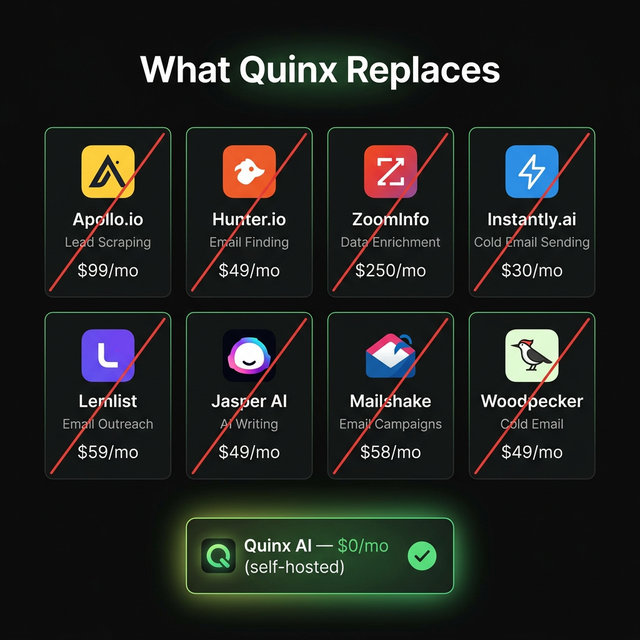
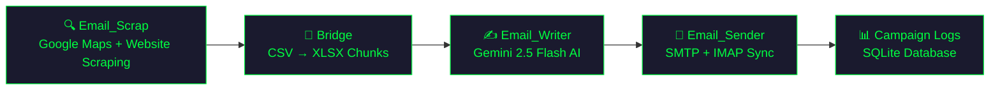

<p align="center">
  
</p>

<h1 align="center">Quinx AI SaaS</h1>

<p align="center">
  <strong>End-to-end cold email outreach automation — from lead scraping to inbox delivery. Now built as a Multi-Tenant SaaS platform.</strong>
</p>

<p align="center">
  
  
  
  
  
</p>

---

## 🎯 What is Quinx?

**Quinx AI** is a four-stage automation pipeline that handles the entire cold outreach lifecycle. In its fully-hosted SaaS form, it provides complete manual control while ensuring data isolation and task delegation:

1. **🔍 Scrape** — Find businesses on Google Maps, extract emails from their websites
2. **✍️ Write** — Generate hyper-personalized cold emails using AI (Gemini 2.5 Flash / OpenRouter)
3. **🚀 Send** — Deliver emails via SMTP with human-like delays and IMAP Sent-folder sync
4. **📊 Log** — Track every campaign, lead, and email safely in the database

All stages can be run individually or seamlessly controlled through a beautiful, terminal-inspired **SaaS Control Panel**.

---

## 💰 What Quinx Replaces

<p align="center">
  
</p>

Quinx is a **self-hosted, open-source alternative** to an entire stack of expensive SaaS tools. Here's what you no longer need to pay for:

### Lead Scraping & Enrichment

| Tool | What It Does | Monthly Cost | Quinx Replacement |
|------|-------------|:------------:|-------------------|
|  | Lead database & prospecting | **$99/mo** | `Email_Scrap` — Google Maps scraping + email extraction |
|  | Email finder & verifier | **$49/mo** | `scrape_website_emails.py` — regex + BeautifulSoup extraction |
|  | B2B data enrichment | **$250/mo** | `enrich_lead.py` — website context scraping + Schema.org parsing |

### AI Email Writing

| Tool | What It Does | Monthly Cost | Quinx Replacement |
|------|-------------|:------------:|-------------------|
|  | AI copywriting assistant | **$49/mo** | `write_email.py` — Gemini 2.5 Flash with strict quality rules |
|  | AI marketing copy generator | **$49/mo** | Same — rule-bound AI with auto-retry & validation |

### Cold Email Sending & Campaigns

| Tool | What It Does | Monthly Cost | Quinx Replacement |
|------|-------------|:------------:|-------------------|
|  | Cold email at scale | **$30/mo** | `Email_Sender` — SMTP delivery with human-like delays |
|  | Personalized outreach | **$59/mo** | Full pipeline — scrape, personalize, send |
|  | Sales engagement platform | **$58/mo** | `run_pipeline.py` — end-to-end orchestration |
|  | Cold email automation | **$49/mo** | SMTP + IMAP sync with send-folder verification |

### 💸 Total Savings

```
Monthly SaaS cost:   $693/mo  →  $8,316/year
Quinx cost:          $0/mo    (self-hosted, bring your own API keys)
─────────────────────────────────────────────────
You save:            ~$8,000+/year
```

> **Note:** Quinx only costs the API usage fees you'd pay anyway — Google Maps API (~$0.01/search), OpenRouter/Gemini (~$0.001/email), and your own SMTP server.

---

## 🏗️ Architecture

```
Quinx/
├── run_pipeline.py          # 🎯 Master CLI orchestrator
├── Email_Scrap/             # Stage 1: Lead generation
│   ├── tools/
│   │   ├── google_maps_search.py
│   │   ├── scrape_website_emails.py
│   │   ├── build_leads_csv.py
│   │   ├── build_outreach_xlsx.py
│   │   ├── pipeline.py
│   │   ├── db_handler.py
│   │   └── ...
│   ├── .env.example
│   └── Leads/               # Scraped lead files
├── Email_Writer/            # Stage 2: AI email generation
│   ├── tools/
│   │   ├── batch_write_emails.py
│   │   ├── enrich_lead.py
│   │   ├── write_email.py
│   │   └── csv_handler.py
│   ├── leads/               # Input chunks
│   ├── emails/              # Output emails
│   └── .env.example
├── Email_Sender/            # Stage 3: Email delivery
│   ├── src/
│   │   ├── index.js
│   │   ├── hostinger.js
│   │   ├── mailer.js
│   │   ├── leads.js
│   │   └── ...
│   └── .env.example
├── Leads/                   # Consolidated lead XLSX files
├── Emails/                  # Final email XLSX files
├── quinx-saas/              # 🖥️ SaaS Control Panel (Multi-Tenant)
│   ├── backend/             # FastAPI + SQLModel + Celery
│   │   ├── main.py
│   │   ├── core/            # Config, Security, Celery tasks, Database integration
│   │   ├── api/             # API Router Endpoints
│   │   └── requirements.txt
│   └── frontend/            # React 19 + Vite + Tailwind CSS
│       └── src/
│           ├── App.tsx
│           ├── lib/api.ts   # Central API client
│           ├── pages/
│           │   ├── Auth.tsx      # Login & Signup
│           │   ├── Campaign.tsx  # Campaign config manager
│           │   ├── Scraper.tsx
│           │   ├── Writer.tsx
│           │   ├── Sender.tsx
│           │   └── Logs.tsx
│           └── components/
│               ├── Sidebar.tsx
│               └── ...
└── docs/                    # Documentation assets
```

---

## 🔄 Pipeline Flow



### How It Works

| Stage | What Happens | Key Tech |
|-------|-------------|----------|
| **1. Scrape** | Search Google Maps for businesses → scrape their websites for emails, phones, owner names | Google Places API, BeautifulSoup, Regex |
| **2. Bridge** | Filter leads without emails, apply fallback names, chunk into XLSX batches | openpyxl, built into `run_pipeline.py` |
| **3. Write** | Enrich each lead with website context → generate personalized emails with strict quality rules | Gemini 2.5 Flash via OpenRouter |
| **4. Send** | Send emails via Hostinger SMTP (port 465) with 10-15s random delays, save to IMAP Sent folder | SMTP/IMAP, Node.js, Playwright |

---

## ⚡ Quick Start

### Prerequisites

- **Python 3.12+** with pip
- **Node.js 18+** with npm
- API keys (see [Configuration](#-configuration))

### 1. Clone the Repository

```bash
git clone https://github.com/YOUR_USERNAME/Quinx.git
cd Quinx
```

### 2. Set Up Environment Files

Copy all `.env.example` files to `.env` and fill in your API keys:

```bash
# Email Scraper
cp Email_Scrap/.env.example Email_Scrap/.env

# Email Writer
cp Email_Writer/.env.example Email_Writer/.env

# Email Sender
cp Email_Sender/.env.example Email_Sender/.env
```

### 3. Install Dependencies

```bash
# Python dependencies (Email_Scrap)
pip install -r Email_Scrap/requirements.txt

# Python dependencies (Email_Writer)
pip install -r Email_Writer/requirements.txt

# Node.js dependencies (Email_Sender)
cd Email_Sender && npm install && cd ..
```

### 4. Run the Full Pipeline (CLI)

```bash
# Single city
python run_pipeline.py --niche "cafes" --cities "London UK"

# Multiple cities
python run_pipeline.py --niche "bakeries" --cities "London UK" "Paris France" "Berlin Germany"

# Trial run (10 leads only)
python run_pipeline.py --niche "cafes" --cities "Tokyo Japan" --max-leads 10 --fresh

# Auto-send after generation
python run_pipeline.py --niche "restaurants" --cities "New York City USA" --send

# Send from existing output file
python run_pipeline.py --send-only "Email_Writer/emails/email_output_10chunks.xlsx"
```

---

## 🖥️ SaaS Control Panel

The Quinx SaaS module provides a full-stack dashboard to manage all pipeline stages online efficiently and multi-tenant without touching the CLI.

### Setup

```bash
# Backend
cd quinx-saas/backend
python -m venv venv
venv\Scripts\activate          # Windows
# source venv/bin/activate     # macOS/Linux
pip install -r requirements.txt

# Redis (Required for Celery Background Tasks)
# Ensure you have Redis running on your system or via Docker:
# docker run -p 6379:6379 -d redis

# Frontend
cd ../frontend
npm install
```

### Running

Open **three terminals**:

```bash
# Terminal 1 — Backend (FastAPI)
cd quinx-saas/backend
venv\Scripts\activate
uvicorn main:app --reload
# → http://localhost:8000 (API docs at /docs)

# Terminal 2 — Background Worker (Celery)
cd quinx-saas/backend
venv\Scripts\activate
celery -A core.celery_app worker --loglevel=info

# Terminal 3 — Frontend (React + Vite)
cd quinx-saas/frontend
npm run dev
# → http://localhost:5173
```

### SaaS Features

| Module | Description |
|--------|-------------|
| **🔒 Auth** | JWT-based Auth (Signup / Login / Private Routes) to access isolated data. |
| **⚡ Settings** | Connect emails (Hostinger/SMTP/Gmail OAuth). Admin sets Anthropic spend limits. |
| **🔍 Scraper** | Configure niche, select cities, set limits, run background scraping tasks with WebSocket-streamed output. |
| **✍️ Writer** | Load campaigns, set config, calculate token costs & limits, and send AI email generation task to Celery. |
| **🚀 Sender** | Configure accounts & delays, dispatch email workloads securely without blocking the FastApi server. |
| **📊 Logs** | Live stats tracking, full paginated table with scraped/written/sent statuses crossing, and XLSX export. |

> **Design:** Dark hacker-dashboard aesthetic · JetBrains Mono font · Terminal green (#00ff88) accents · Real-time WebSocket streaming

---

## ⚙️ Configuration

### Email_Scrap (`Email_Scrap/.env`)

| Variable | Description |
|----------|-------------|
| `GEMINI_API_KEY` | Google Gemini API key |
| `GOOGLE_MAPS_API_KEY` | Google Maps Places API (New) key |

### Email_Writer (`Email_Writer/.env`)

| Variable | Description |
|----------|-------------|
| `ANTHROPIC_API_KEY` | Anthropic API key (primary AI provider) |
| `OPENROUTER_API_KEY_1` | OpenRouter API key (primary fallback) |
| `OPENROUTER_API_KEY_2` | Fallback key for rate-limit rotation |
| `OPENROUTER_API_KEY_3` | Fallback key for rate-limit rotation |
| `OPENROUTER_API_KEY_4` | Fallback key for rate-limit rotation |

### Email_Sender (`Email_Sender/.env`)

| Variable | Description | Default |
|----------|-------------|---------|
| `HOSTINGER_EMAIL` | Hostinger webmail login email | — |
| `HOSTINGER_PASSWORD` | Hostinger webmail password | — |
| `LEADS_FILE` | Path to email output XLSX | — |
| `HEADLESS` | Run Playwright in headless mode | `true` |
| `LOG_LEVEL` | Logging verbosity | `info` |

---

## 📧 Email Quality Rules

The AI email writer enforces strict rules to ensure high deliverability and engagement:

| Rule | Constraint |
|------|-----------|
| **Subject line** | < 9 words, no spam triggers |
| **Body length** | 90–130 words |
| **Personalization** | Must reference ≥ 2 scraped data points |
| **Tone** | Conversational, no corporate speak |
| **Compliance** | Lead enrichment context required |
| **Retry** | Auto-retry on rule violations |
| **Skip** | Leads with < 2 personalization fields are skipped |

---

## 🛡️ Safety Features

- **📨 Daily send limits** — Hard caps to prevent spam flagging
- **⏱️ Human-like delays** — 10-15s random delays between emails
- **📋 IMAP sync** — Every sent email is copied to the Sent folder for verification
- **🔄 Resume support** — Pipeline builds intermediate state files (`.tmp/`) for failure recovery
- **🔑 API key rotation** — Auto-rotates OpenRouter keys on rate limits
- **✅ Email validation** — Strict AI output validation before sending

---

## 🗄️ Database

Quinx SaaS handles complete data isolation (all rows keyed by `user_id`):

| Database | Location | Purpose |
|----------|----------|---------|
| `leads.db` | Project root | Master CLI lead database |
| `quinx_saas.db` | `quinx-saas/backend/` | PostgreSQL or local SQLite for SaaS Platform (Auth, Campaigns, Accounts) |

---

## 📁 CLI Reference

```
python run_pipeline.py [OPTIONS]

Options:
  --niche TEXT          Business type to target (cafes, bakeries, etc.)
  --cities CITY [CITY]  Cities to scrape. Defaults to 25 high-ROI cities
  --chunk-size INT      Leads per Email_Writer chunk (default: 20)
  --max-leads INT       Cap total leads (useful for trial runs)
  --fresh               Skip dedup against existing Leads/ folder
  --send                Auto-send emails after generation
  --send-only XLSX      Skip scraping/writing — send from existing file
```

### Default High-ROI Cities (25)

New York, Los Angeles, Chicago, Toronto, Miami, Houston, Vancouver, Atlanta, London, Berlin, Amsterdam, Paris, Barcelona, Dubai, Manchester, Sydney, Melbourne, Singapore, Tokyo, Mumbai, Auckland, São Paulo, Mexico City, Buenos Aires, Bogotá

---

## 🧰 Tech Stack

| Layer | Technology |
|-------|-----------|
| **Lead Scraping** | Python, Google Maps Places API, BeautifulSoup, Regex |
| **Email Writing** | Python, Gemini 2.5 Flash (OpenRouter), openpyxl |
| **Email Sending** | Node.js, SMTP (Hostinger), IMAP, Playwright |
| **Task Queue** | Celery + Redis |
| **SaaS Backend** | FastAPI, SQLModel (PostgreSQL/SQLite), WebSockets, JWT Auth |
| **SaaS Frontend** | React 19, Vite, Tailwind CSS, React Router |

---

## 📄 License

This project is private. All rights reserved.

---

<p align="center">
  Built with 💚 by <strong>Quinx AI</strong>
</p>
